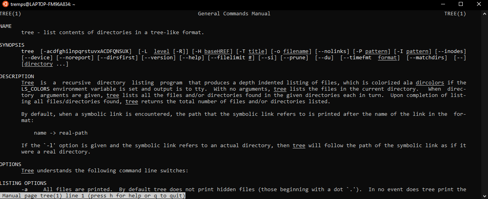
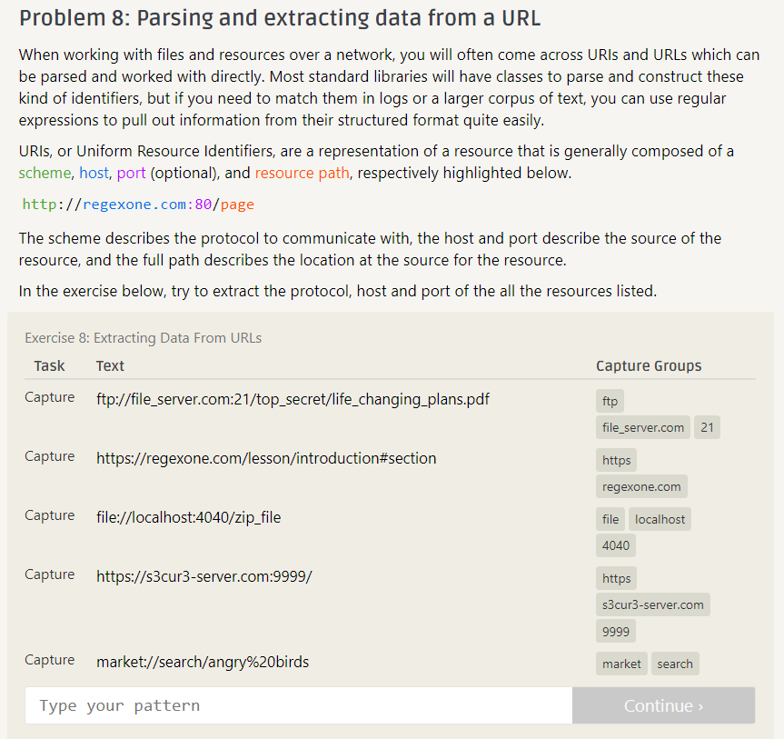
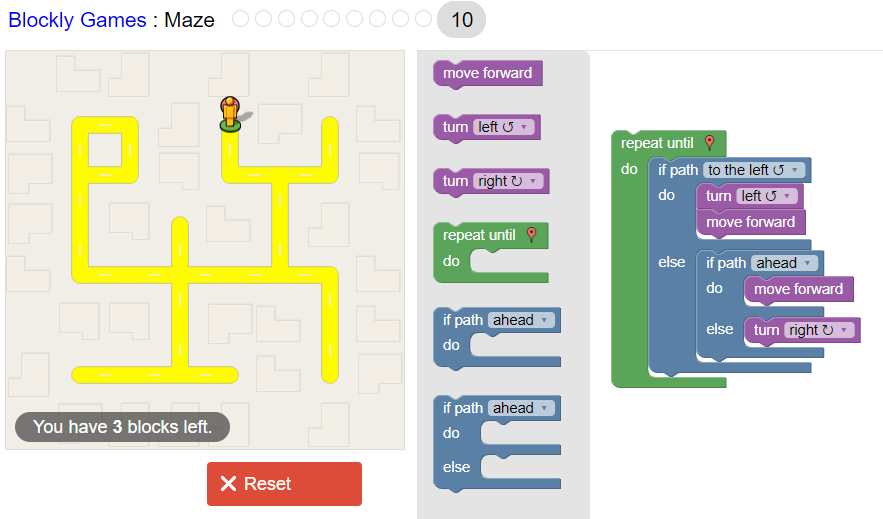

# Lab 01 Report - Introduction to Open Source Software

##### Discord Screenshot
 
My name is displayed as Stephen by the message because I set my nickname on the server.

### Readings
I read the open source definition and understand why the 10 criteria are important to keeping open source software available to all.

##### Suggestions for "How To Answer Questions in a Helpful Way"
1. The author could add links to good and bad examples from actual discussion forms.
2. When answering a question, try to judge the ability of the person asking from how they ask their question. From this you can determine how techincal of a response you can give and how many details you should clarify.

##### Free Culture Chapter 3
I found this reading very disturbing. Jesse's decision to make the search engine was not at all malicious. He did it for the educational benefit to himself and to improve RPI's netwrork to allow easier access to files for students and faculty. As a society we should be promoting students with this kind of initiative not pulling them down. While his software did enable the sharing of music, these files were already availale to anyone on RPI's network. All he did was make it easier to find them. Jesse being sued for this goes to far. I feel the RIAA should not have been allowed to do more than require Jesse to take the music files off his search engine.

### Man Tree
 

##### 7 regex practice problems
 
The image shows that I have gotten to problem 8, therefore I have completed the 7 prevous problems.

##### 4 regex crosswords
 
 
 
 

##### blockly
 

### Project Search
I am interested in cyber security so I am considering doing a project within the field. I would primarily be interested in working on a red team project because in general I learn more from the offensive side and also find these projects more enjoyable. To begin my project search I found this site https://awesomeopensource.com/projects/red-team which lists many open source red team projects and began reading through some of the options. Some of the projects that stood out to me are Shad0w, Hack Tools, and Packetwhisper.
