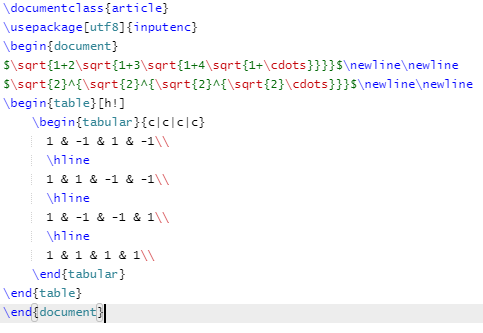

### LaTex
##### Source
 
##### Output
 
### RCOS Projects
[stats of table 8's projects](https://docs.google.com/document/d/1ba5yExqEPxpVeJ9VadcYCiYgZS4C0YgzuyApd5GrQSo/edit?usp=sharing) 
This document contains all of my groups collected data on our assigned RCOS projects including screenshots of gitstats and gource.
##### Gitstats vs maualy finding data
Overall gitstats is much nicer as it provides much more detail about the project. It allows you to analyze individual files, shows total lines added and removed, and generates graphs to vizualize all of the data. We noticed that they're sometimes were differences between the data on gitstats and the data off github like total number of lines and contributors.
