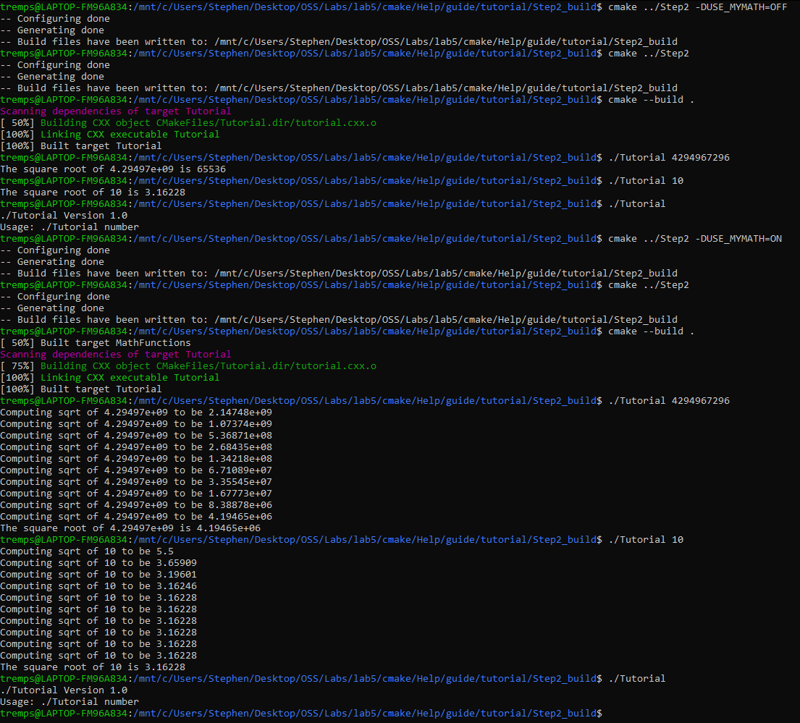
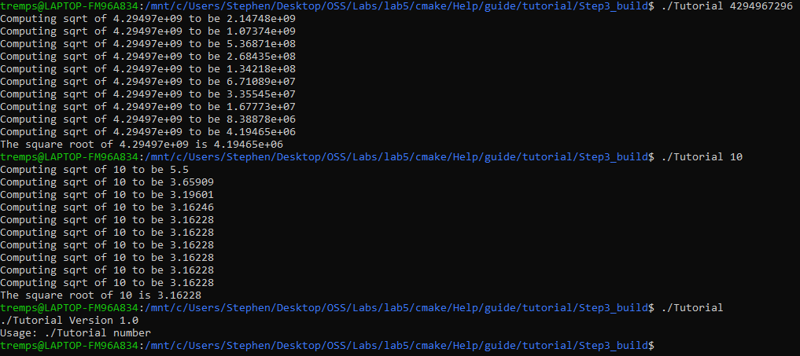
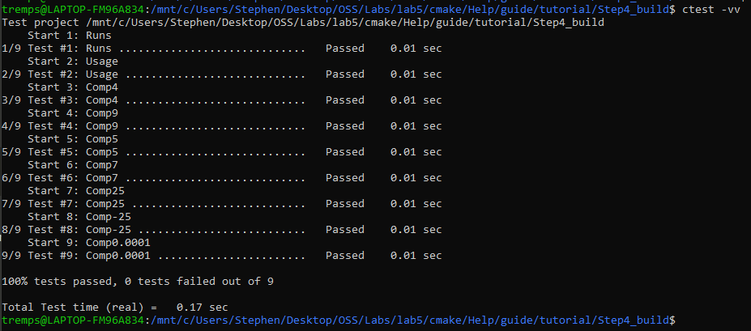
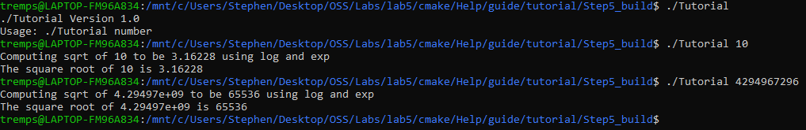
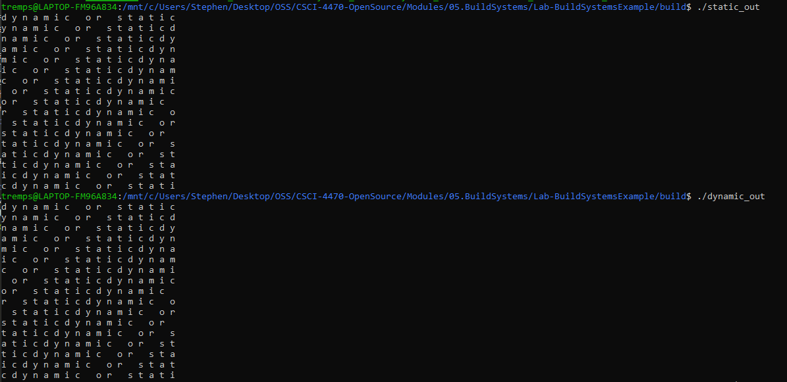

# Stephen Trempel OSS Lab 5
## Tutorial
### Steps 1 & 2
#### tutorial.cxx
```
// A simple program that computes the square root of a number
#include <cmath>
#include <iostream>
#include <string>

#include "TutorialConfig.h"

#ifdef USE_MYMATH
#  include "MathFunctions.h"
#endif

int main(int argc, char* argv[])
{
  if (argc < 2) {
    // report version
    std::cout << argv[0] << " Version " << Tutorial_VERSION_MAJOR << "."
              << Tutorial_VERSION_MINOR << std::endl;
    std::cout << "Usage: " << argv[0] << " number" << std::endl;
    return 1;
  }

  // convert input to double
  const double inputValue = std::stod(argv[1]);

  // calculate square root
  #ifdef USE_MYMATH
    const double outputValue = mysqrt(inputValue);
  #else
    const double outputValue = sqrt(inputValue);
  #endif
  std::cout << "The square root of " << inputValue << " is " << outputValue
            << std::endl;
  return 0;
}
```
#### CMakeLists.txt
```
cmake_minimum_required(VERSION 3.10)

# set the project name and version
project(Tutorial VERSION 1.0)

# specify the C++ standard
set(CMAKE_CXX_STANDARD 11)
set(CMAKE_CXX_STANDARD_REQUIRED True)

option(USE_MYMATH "Use tutorial provided math implementation" ON)

# configure a header file to pass some of the CMake settings
# to the source code
configure_file(TutorialConfig.h.in TutorialConfig.h)

if(USE_MYMATH)
  add_subdirectory(MathFunctions)
  list(APPEND EXTRA_LIBS MathFunctions)
  list(APPEND EXTRA_INCLUDES "${PROJECT_SOURCE_DIR}/MathFunctions")
endif()

# add the executable
add_executable(Tutorial tutorial.cxx)

target_link_libraries(Tutorial PUBLIC ${EXTRA_LIBS})

# add the binary tree to the search path for include files
# so that we will find TutorialConfig.h
target_include_directories(Tutorial PUBLIC
                           "${PROJECT_BINARY_DIR}"
                           "${EXTRA_INCLUDES}"
                           )
```
#### Output -- first with sqrt then with mysqrt

### Step 3
#### CMakeLists.txt
```
cmake_minimum_required(VERSION 3.10)

# set the project name and version
project(Tutorial VERSION 1.0)

# specify the C++ standard
set(CMAKE_CXX_STANDARD 11)
set(CMAKE_CXX_STANDARD_REQUIRED True)

# should we use our own math functions
option(USE_MYMATH "Use tutorial provided math implementation" ON)

# configure a header file to pass some of the CMake settings
# to the source code
configure_file(TutorialConfig.h.in TutorialConfig.h)

# add the MathFunctions library
if(USE_MYMATH)
  add_subdirectory(MathFunctions)
  list(APPEND EXTRA_LIBS MathFunctions)
endif()

# add the executable
add_executable(Tutorial tutorial.cxx)

target_link_libraries(Tutorial PUBLIC ${EXTRA_LIBS})

# add the binary tree to the search path for include files
# so that we will find TutorialConfig.h
target_include_directories(Tutorial PUBLIC
                           "${PROJECT_BINARY_DIR}"
                           )
```
#### MathFunctions/CMakeLists.txt
```
add_library(MathFunctions mysqrt.cxx)
target_include_directories(MathFunctions INTERFACE ${CMAKE_CURRENT_SOURCE_DIR})
```
#### Output

### Step 4
#### CMakeLists.txt
```
cmake_minimum_required(VERSION 3.10)

# set the project name and version
project(Tutorial VERSION 1.0)

# specify the C++ standard
set(CMAKE_CXX_STANDARD 11)
set(CMAKE_CXX_STANDARD_REQUIRED True)

# should we use our own math functions
option(USE_MYMATH "Use tutorial provided math implementation" ON)

# configure a header file to pass some of the CMake settings
# to the source code
configure_file(TutorialConfig.h.in TutorialConfig.h)

# add the MathFunctions library
if(USE_MYMATH)
  add_subdirectory(MathFunctions)
  list(APPEND EXTRA_LIBS MathFunctions)
endif()

# add the executable
add_executable(Tutorial tutorial.cxx)

target_link_libraries(Tutorial PUBLIC ${EXTRA_LIBS})

# add the binary tree to the search path for include files
# so that we will find TutorialConfig.h
target_include_directories(Tutorial PUBLIC
                           "${PROJECT_BINARY_DIR}"
                           )
install(TARGETS Tutorial DESTINATION bin)
install(FILES "${PROJECT_BINARY_DIR}/TutorialConfig.h" DESTINATION include)


enable_testing()

# does the application run
add_test(NAME Runs COMMAND Tutorial 25)

# does the usage message work?
add_test(NAME Usage COMMAND Tutorial)
set_tests_properties(Usage
  PROPERTIES PASS_REGULAR_EXPRESSION "Usage:.*number"
  )

# define a function to simplify adding tests
function(do_test target arg result)
  add_test(NAME Comp${arg} COMMAND ${target} ${arg})
  set_tests_properties(Comp${arg}
    PROPERTIES PASS_REGULAR_EXPRESSION ${result}
    )
endfunction(do_test)

# do a bunch of result based tests
do_test(Tutorial 4 "4 is 2")
do_test(Tutorial 9 "9 is 3")
do_test(Tutorial 5 "5 is 2.236")
do_test(Tutorial 7 "7 is 2.645")
do_test(Tutorial 25 "25 is 5")
do_test(Tutorial -25 "-25 is [-nan|nan|0]")
do_test(Tutorial 0.0001 "0.0001 is 0.01")
```
#### MathFunctions/CMakeLists.txt
```
add_library(MathFunctions mysqrt.cxx)

# state that anybody linking to us needs to include the current source dir
# to find MathFunctions.h, while we don't.
target_include_directories(MathFunctions
          INTERFACE ${CMAKE_CURRENT_SOURCE_DIR}
          )
install(TARGETS MathFunctions DESTINATION lib)
install(FILES MathFunctions.h DESTINATION include)
```

### Step 5
#### CMakeLists.txt
```
cmake_minimum_required(VERSION 3.10)

# set the project name and version
project(Tutorial VERSION 1.0)

# specify the C++ standard
set(CMAKE_CXX_STANDARD 11)
set(CMAKE_CXX_STANDARD_REQUIRED True)

# should we use our own math functions
option(USE_MYMATH "Use tutorial provided math implementation" ON)

# configure a header file to pass some of the CMake settings
# to the source code
configure_file(TutorialConfig.h.in TutorialConfig.h)

# add the MathFunctions library
if(USE_MYMATH)
  add_subdirectory(MathFunctions)
  list(APPEND EXTRA_LIBS MathFunctions)
endif()

# add the executable
add_executable(Tutorial tutorial.cxx)
target_link_libraries(Tutorial PUBLIC ${EXTRA_LIBS})

# add the binary tree to the search path for include files
# so that we will find TutorialConfig.h
target_include_directories(Tutorial PUBLIC
                           "${PROJECT_BINARY_DIR}"
                           )

# add the install targets
install(TARGETS Tutorial DESTINATION bin)
install(FILES "${PROJECT_BINARY_DIR}/TutorialConfig.h"
  DESTINATION include
  )

# enable testing
enable_testing()

# does the application run
add_test(NAME Runs COMMAND Tutorial 25)

# does the usage message work?
add_test(NAME Usage COMMAND Tutorial)
set_tests_properties(Usage
  PROPERTIES PASS_REGULAR_EXPRESSION "Usage:.*number"
  )

# define a function to simplify adding tests
function(do_test target arg result)
  add_test(NAME Comp${arg} COMMAND ${target} ${arg})
  set_tests_properties(Comp${arg}
    PROPERTIES PASS_REGULAR_EXPRESSION ${result}
    )
endfunction(do_test)

# do a bunch of result based tests
do_test(Tutorial 4 "4 is 2")
do_test(Tutorial 9 "9 is 3")
do_test(Tutorial 5 "5 is 2.236")
do_test(Tutorial 7 "7 is 2.645")
do_test(Tutorial 25 "25 is 5")
do_test(Tutorial -25 "-25 is [-nan|nan|0]")
do_test(Tutorial 0.0001 "0.0001 is 0.01")
```
#### MathFunctions/CMakeLists.txt
```
add_library(MathFunctions mysqrt.cxx)

# state that anybody linking to us needs to include the current source dir
# to find MathFunctions.h, while we don't.
target_include_directories(MathFunctions
          INTERFACE ${CMAKE_CURRENT_SOURCE_DIR}
          )

# install rules
install(TARGETS MathFunctions DESTINATION lib)
install(FILES MathFunctions.h DESTINATION include)

include(CheckSymbolExists)
check_symbol_exists(log "math.h" HAVE_LOG)
check_symbol_exists(exp "math.h" HAVE_EXP)
if(NOT (HAVE_LOG AND HAVE_EXP))
  unset(HAVE_LOG CACHE)
  unset(HAVE_EXP CACHE)
  set(CMAKE_REQUIRED_LIBRARIES "m")
  check_symbol_exists(log "math.h" HAVE_LOG)
  check_symbol_exists(exp "math.h" HAVE_EXP)
  if(HAVE_LOG AND HAVE_EXP)
    target_link_libraries(MathFunctions PRIVATE m)
  endif()
endif()

if(HAVE_LOG AND HAVE_EXP)
  target_compile_definitions(MathFunctions PRIVATE "HAVE_LOG" "HAVE_EXP")
endif()
```
#### Output

## BuildSystemsExample
### Makefile
```
all: static_out dynamic_out

program.o: program.c headers/block.h
  gcc -c program.c -o program.o

block.o: source/block.c headers/block.h
  gcc -c -fPIC source/block.c -o block.o

static_block: block.o
  ar rcs s_lib.a block.o

dynamic_block: block.o
  gcc -shared block.o -o d_lib.so

static_out: static_block program.o
  gcc program.o s_lib.a -o static_out

dynamic_out: dynamic_block program.o
  gcc program.o d_lib.so -o dynamic_out -Wl,-rpath .

clean:
  rm -rf *.o *.a *.so *_out
```
### CMakeLists.txt
```
cmake_minimum_required(VERSION 1.0)
project(block C)

add_library(dynamic_lib SHARED source/block.c headers/block.h)
add_executable(dynamic_out program.c)
target_link_libraries(dynamic_out dynamic_lib)


add_library(static_lib source/block.c headers/block.h)
add_executable(static_out program.c)
target_link_libraries(static_out static_lib)
```
### CMake generated Makefile
```
# CMAKE generated file: DO NOT EDIT!
# Generated by "Unix Makefiles" Generator, CMake Version 3.10

# Default target executed when no arguments are given to make.
default_target: all

.PHONY : default_target

# The main recursive all target
all:

.PHONY : all

# The main recursive preinstall target
preinstall:

.PHONY : preinstall

#=============================================================================
# Special targets provided by cmake.

# Disable implicit rules so canonical targets will work.
.SUFFIXES:


# Remove some rules from gmake that .SUFFIXES does not remove.
SUFFIXES =

.SUFFIXES: .hpux_make_needs_suffix_list


# Suppress display of executed commands.
$(VERBOSE).SILENT:


# A target that is always out of date.
cmake_force:

.PHONY : cmake_force

#=============================================================================
# Set environment variables for the build.

# The shell in which to execute make rules.
SHELL = /bin/sh

# The CMake executable.
CMAKE_COMMAND = /usr/bin/cmake

# The command to remove a file.
RM = /usr/bin/cmake -E remove -f

# Escaping for special characters.
EQUALS = =

# The top-level source directory on which CMake was run.
CMAKE_SOURCE_DIR = /mnt/c/Users/Stephen/Desktop/OSS/CSCI-4470-OpenSource/Modules/05.BuildSystems/Lab-BuildSystemsExample

# The top-level build directory on which CMake was run.
CMAKE_BINARY_DIR = /mnt/c/Users/Stephen/Desktop/OSS/CSCI-4470-OpenSource/Modules/05.BuildSystems/Lab-BuildSystemsExample/build

#=============================================================================
# Target rules for target CMakeFiles/static_out.dir

# All Build rule for target.
CMakeFiles/static_out.dir/all: CMakeFiles/static_lib.dir/all
  $(MAKE) -f CMakeFiles/static_out.dir/build.make CMakeFiles/static_out.dir/depend
  $(MAKE) -f CMakeFiles/static_out.dir/build.make CMakeFiles/static_out.dir/build
  @$(CMAKE_COMMAND) -E cmake_echo_color --switch=$(COLOR) --progress-dir=/mnt/c/Users/Stephen/Desktop/OSS/CSCI-4470-OpenSource/Modules/05.BuildSystems/Lab-BuildSystemsExample/build/CMakeFiles --progress-num=7,8 "Built target static_out"
.PHONY : CMakeFiles/static_out.dir/all

# Include target in all.
all: CMakeFiles/static_out.dir/all

.PHONY : all

# Build rule for subdir invocation for target.
CMakeFiles/static_out.dir/rule: cmake_check_build_system
  $(CMAKE_COMMAND) -E cmake_progress_start /mnt/c/Users/Stephen/Desktop/OSS/CSCI-4470-OpenSource/Modules/05.BuildSystems/Lab-BuildSystemsExample/build/CMakeFiles 4
  $(MAKE) -f CMakeFiles/Makefile2 CMakeFiles/static_out.dir/all
  $(CMAKE_COMMAND) -E cmake_progress_start /mnt/c/Users/Stephen/Desktop/OSS/CSCI-4470-OpenSource/Modules/05.BuildSystems/Lab-BuildSystemsExample/build/CMakeFiles 0
.PHONY : CMakeFiles/static_out.dir/rule

# Convenience name for target.
static_out: CMakeFiles/static_out.dir/rule

.PHONY : static_out

# clean rule for target.
CMakeFiles/static_out.dir/clean:
  $(MAKE) -f CMakeFiles/static_out.dir/build.make CMakeFiles/static_out.dir/clean
.PHONY : CMakeFiles/static_out.dir/clean

# clean rule for target.
clean: CMakeFiles/static_out.dir/clean

.PHONY : clean

#=============================================================================
# Target rules for target CMakeFiles/static_lib.dir

# All Build rule for target.
CMakeFiles/static_lib.dir/all:
  $(MAKE) -f CMakeFiles/static_lib.dir/build.make CMakeFiles/static_lib.dir/depend
  $(MAKE) -f CMakeFiles/static_lib.dir/build.make CMakeFiles/static_lib.dir/build
  @$(CMAKE_COMMAND) -E cmake_echo_color --switch=$(COLOR) --progress-dir=/mnt/c/Users/Stephen/Desktop/OSS/CSCI-4470-OpenSource/Modules/05.BuildSystems/Lab-BuildSystemsExample/build/CMakeFiles --progress-num=5,6 "Built target static_lib"
.PHONY : CMakeFiles/static_lib.dir/all

# Include target in all.
all: CMakeFiles/static_lib.dir/all

.PHONY : all

# Build rule for subdir invocation for target.
CMakeFiles/static_lib.dir/rule: cmake_check_build_system
  $(CMAKE_COMMAND) -E cmake_progress_start /mnt/c/Users/Stephen/Desktop/OSS/CSCI-4470-OpenSource/Modules/05.BuildSystems/Lab-BuildSystemsExample/build/CMakeFiles 2
  $(MAKE) -f CMakeFiles/Makefile2 CMakeFiles/static_lib.dir/all
  $(CMAKE_COMMAND) -E cmake_progress_start /mnt/c/Users/Stephen/Desktop/OSS/CSCI-4470-OpenSource/Modules/05.BuildSystems/Lab-BuildSystemsExample/build/CMakeFiles 0
.PHONY : CMakeFiles/static_lib.dir/rule

# Convenience name for target.
static_lib: CMakeFiles/static_lib.dir/rule

.PHONY : static_lib

# clean rule for target.
CMakeFiles/static_lib.dir/clean:
  $(MAKE) -f CMakeFiles/static_lib.dir/build.make CMakeFiles/static_lib.dir/clean
.PHONY : CMakeFiles/static_lib.dir/clean

# clean rule for target.
clean: CMakeFiles/static_lib.dir/clean

.PHONY : clean

#=============================================================================
# Target rules for target CMakeFiles/dynamic_lib.dir

# All Build rule for target.
CMakeFiles/dynamic_lib.dir/all:
  $(MAKE) -f CMakeFiles/dynamic_lib.dir/build.make CMakeFiles/dynamic_lib.dir/depend
  $(MAKE) -f CMakeFiles/dynamic_lib.dir/build.make CMakeFiles/dynamic_lib.dir/build
  @$(CMAKE_COMMAND) -E cmake_echo_color --switch=$(COLOR) --progress-dir=/mnt/c/Users/Stephen/Desktop/OSS/CSCI-4470-OpenSource/Modules/05.BuildSystems/Lab-BuildSystemsExample/build/CMakeFiles --progress-num=1,2 "Built target dynamic_lib"
.PHONY : CMakeFiles/dynamic_lib.dir/all

# Include target in all.
all: CMakeFiles/dynamic_lib.dir/all

.PHONY : all

# Build rule for subdir invocation for target.
CMakeFiles/dynamic_lib.dir/rule: cmake_check_build_system
  $(CMAKE_COMMAND) -E cmake_progress_start /mnt/c/Users/Stephen/Desktop/OSS/CSCI-4470-OpenSource/Modules/05.BuildSystems/Lab-BuildSystemsExample/build/CMakeFiles 2
  $(MAKE) -f CMakeFiles/Makefile2 CMakeFiles/dynamic_lib.dir/all
  $(CMAKE_COMMAND) -E cmake_progress_start /mnt/c/Users/Stephen/Desktop/OSS/CSCI-4470-OpenSource/Modules/05.BuildSystems/Lab-BuildSystemsExample/build/CMakeFiles 0
.PHONY : CMakeFiles/dynamic_lib.dir/rule

# Convenience name for target.
dynamic_lib: CMakeFiles/dynamic_lib.dir/rule

.PHONY : dynamic_lib

# clean rule for target.
CMakeFiles/dynamic_lib.dir/clean:
  $(MAKE) -f CMakeFiles/dynamic_lib.dir/build.make CMakeFiles/dynamic_lib.dir/clean
.PHONY : CMakeFiles/dynamic_lib.dir/clean

# clean rule for target.
clean: CMakeFiles/dynamic_lib.dir/clean

.PHONY : clean

#=============================================================================
# Target rules for target CMakeFiles/dynamic_out.dir

# All Build rule for target.
CMakeFiles/dynamic_out.dir/all: CMakeFiles/dynamic_lib.dir/all
  $(MAKE) -f CMakeFiles/dynamic_out.dir/build.make CMakeFiles/dynamic_out.dir/depend
  $(MAKE) -f CMakeFiles/dynamic_out.dir/build.make CMakeFiles/dynamic_out.dir/build
  @$(CMAKE_COMMAND) -E cmake_echo_color --switch=$(COLOR) --progress-dir=/mnt/c/Users/Stephen/Desktop/OSS/CSCI-4470-OpenSource/Modules/05.BuildSystems/Lab-BuildSystemsExample/build/CMakeFiles --progress-num=3,4 "Built target dynamic_out"
.PHONY : CMakeFiles/dynamic_out.dir/all

# Include target in all.
all: CMakeFiles/dynamic_out.dir/all

.PHONY : all

# Build rule for subdir invocation for target.
CMakeFiles/dynamic_out.dir/rule: cmake_check_build_system
  $(CMAKE_COMMAND) -E cmake_progress_start /mnt/c/Users/Stephen/Desktop/OSS/CSCI-4470-OpenSource/Modules/05.BuildSystems/Lab-BuildSystemsExample/build/CMakeFiles 4
  $(MAKE) -f CMakeFiles/Makefile2 CMakeFiles/dynamic_out.dir/all
  $(CMAKE_COMMAND) -E cmake_progress_start /mnt/c/Users/Stephen/Desktop/OSS/CSCI-4470-OpenSource/Modules/05.BuildSystems/Lab-BuildSystemsExample/build/CMakeFiles 0
.PHONY : CMakeFiles/dynamic_out.dir/rule

# Convenience name for target.
dynamic_out: CMakeFiles/dynamic_out.dir/rule

.PHONY : dynamic_out

# clean rule for target.
CMakeFiles/dynamic_out.dir/clean:
  $(MAKE) -f CMakeFiles/dynamic_out.dir/build.make CMakeFiles/dynamic_out.dir/clean
.PHONY : CMakeFiles/dynamic_out.dir/clean

# clean rule for target.
clean: CMakeFiles/dynamic_out.dir/clean

.PHONY : clean

#=============================================================================
# Special targets to cleanup operation of make.

# Special rule to run CMake to check the build system integrity.
# No rule that depends on this can have commands that come from listfiles
# because they might be regenerated.
cmake_check_build_system:
  $(CMAKE_COMMAND) -H$(CMAKE_SOURCE_DIR) -B$(CMAKE_BINARY_DIR) --check-build-system CMakeFiles/Makefile.cmake 0
.PHONY : cmake_check_build_system

```
#### static vs dynamic libraries file size comparison
static: 8456 bytes<br />
dynamic: 8288 bytes<br />
File sizes were consistant for dynamic and static libraries between make and cmake. As expected, the dynamic library produced a smaller executable.
#### output

